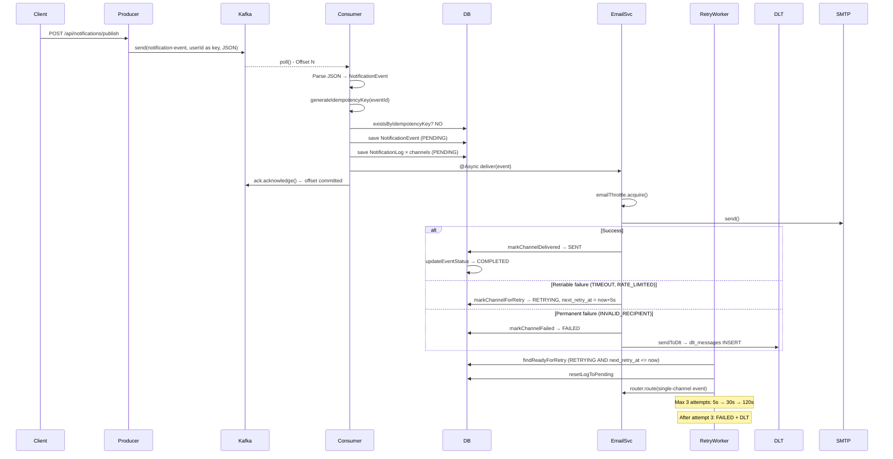

# Notification Engine

A production-grade, event-driven notification delivery system built with Java 21 and Spring Boot 3.5. It consumes notification events from Apache Kafka and delivers them across multiple channels — Email (SMTP), SMS (Twilio), and WebSocket — with full retry logic, exponential backoff, Dead Letter Topic (DLT) handling, idempotency/deduplication, delivery throttling, API rate limiting, and real-time dashboard broadcasting.

---

## Table of Contents

1. [Problem Statement](#1-problem-statement)
2. [Architecture Overview](#2-architecture-overview)
3. [End-to-End Notification Flow](#3-end-to-end-notification-flow)
4. [Tech Stack](#4-tech-stack)
5. [Project Structure](#5-project-structure)
6. [Core Components](#6-core-components)
7. [Database Schema](#7-database-schema)
8. [Kafka Architecture](#8-kafka-architecture)
9. [Retry and DLT Flow](#9-retry-and-dlt-flow)
10. [API Documentation](#10-api-documentation)
11. [WebSocket Documentation](#11-websocket-documentation)
12. [Monitoring and Observability](#12-monitoring-and-observability)
13. [Environment Variables](#13-environment-variables)
14. [Local Setup](#14-local-setup)
15. [Docker Setup](#15-docker-setup)
16. [Running Locally](#16-running-locally)
17. [Testing Guide](#17-testing-guide)
18. [Production Features](#18-production-features)
19. [Scalability Considerations](#19-scalability-considerations)
20. [Future Improvements](#20-future-improvements)
21. [Interview Questions and Answers](#21-interview-questions-and-answers)
22. [Resume Bullet Points](#22-resume-bullet-points)

---

## 1. Problem Statement

Modern distributed systems — e-commerce platforms, fintech apps, ride-hailing services — send millions of notifications daily: order confirmations, payment alerts, delivery updates. A naive implementation that calls an email or SMS API directly inside a REST handler fails in production because:

- **No durability** — if the delivery service is down, the notification is lost.
- **No retries** — transient network failures cause permanent notification loss.
- **No deduplication** — consumer crashes and Kafka replays cause duplicate notifications.
- **No observability** — failed deliveries are invisible without structured tracking.
- **No backpressure** — a thundering herd of deliveries can exhaust SMTP connection pools or hit Twilio rate limits.

This system solves all of these by decoupling notification publishing from delivery using Kafka, persisting every event and delivery attempt to PostgreSQL, and implementing a production-grade pipeline with retries, DLT, idempotency, throttling, and observability.

---

## 2. Architecture Overview

graph TD
    A[Producer / REST Client] -->|POST /api/notifications/publish| B[NotificationProducerController]
    B --> C[NotificationProducer]
    C -->|Kafka send| D[(Kafka Topic: notification-event)]

    D -->|KafkaListener MANUAL ACK| E[NotificationConsumer]
    E -->|Idempotency check| F[IdempotencyService]
    F -->|New message| G[NotificationPersistenceService]
    G -->|Save event + logs| H[(PostgreSQL)]
    G --> I[NotificationRouter]

    I -->|@Async deliveryExecutor| J[EmailNotificationServiceImpl]
    I -->|@Async deliveryExecutor| K[SmsNotificationServiceImpl]
    I -->|@Async deliveryExecutor| L[WebSocketNotificationServiceImpl]

    J -->|Success| M[markChannelDelivered]
    J -->|Retriable fail| N[markChannelForRetry → RETRYING]
    J -->|Permanent fail| O[markChannelFailed + sendToDlt]

    N --> P[RetryWorker @Scheduled 30s]
    P --> Q[RetryExecutionService]
    Q --> I

    O --> R[(dlt_messages table)]
    R -->|POST /api/dlt/messages/id/replay| S[DltService.replayMessage]
    S -->|Re-publish to Kafka| D

    H --> T[NotificationQueryService]
    T --> U[REST APIs - Status, Dashboard, Stats]

    H --> V[DashboardBroadcastService @Scheduled 15s]
    V -->|WebSocket /topic/dashboard/stats| W[Connected Browser Clients]
```

### Component Roles

| Component | Responsibility |
|---|---|
| `NotificationProducer` | Builds `NotificationEvent`, publishes JSON to Kafka topic `notification-event` |
| `NotificationConsumer` | Listens on Kafka with MANUAL ack mode, checks idempotency, persists event, routes |
| `NotificationPersistenceService` | Saves events and per-channel logs, updates status, coordinates DLT dispatch |
| `NotificationRouter` | Dispatches event to Email, SMS, and WebSocket services concurrently via `@Async` |
| `EmailNotificationServiceImpl` | Sends email via JavaMailSender with throttle via `EmailThrottleService` |
| `SmsNotificationServiceImpl` | Sends SMS via Twilio SDK with throttle via `SmsThrottleService` |
| `WebSocketNotificationServiceImpl` | Pushes real-time messages via STOMP/SockJS |
| `RetryWorker` | Scheduled every 30s, scans for RETRYING logs where `next_retry_at <= now` |
| `RetryExecutionService` | Fetches original event, reconstructs single-channel event, re-routes |
| `DltService` | Persists permanently failed messages to `dlt_messages` table; supports replay |
| `IdempotencyService` | Checks `eventId`-based idempotency keys to detect Kafka replays |
| `DashboardBroadcastService` | Broadcasts live stats to `/topic/dashboard/stats` every 15 seconds |
| `DeliverySummaryRefreshService` | Refreshes `notification_delivery_summary` materialized view every 5 minutes |
| `ApiRateLimiter` | In-memory per-user sliding window rate limiter (1000 req/min default) |
| `EmailThrottleService` | Semaphore limiting concurrent SMTP connections (50 default) |
| `SmsThrottleService` | Semaphore limiting concurrent Twilio API calls (20 default) |

---

## 3. End-to-End Notification Flow



---

## 4. Tech Stack

| Category | Technology | Version |
|---|---|---|
| Language | Java | 21 |
| Framework | Spring Boot | 3.5.14 |
| Message Broker | Apache Kafka | 7.4.0 (Confluent) |
| Database | PostgreSQL | 15 |
| ORM | Spring Data JPA / Hibernate | Spring Boot managed |
| DB Migrations | Flyway | Spring Boot managed |
| Email | Spring Boot Mail (JavaMailSender) | SMTP / Gmail |
| SMS | Twilio Java SDK | 9.14.0 |
| WebSocket | Spring WebSocket + STOMP + SockJS | Spring Boot managed |
| Metrics | Micrometer + Prometheus | Spring Boot managed |
| Health | Spring Boot Actuator | Spring Boot managed |
| Async | Spring `@Async` + `ThreadPoolTaskExecutor` | Spring Boot managed |
| Scheduling | Spring `@Scheduled` + `@EnableScheduling` | Spring Boot managed |
| Build Tool | Maven | Wrapper included |
| Containerization | Docker + Docker Compose | Dockerfile multi-stage |
| Kafka UI | Provectus Kafka UI | latest |

---

## 5. Project Structure

```
notification-engine/
├── Dockerfile                          # Multi-stage build (JDK → JRE alpine)
├── docker-compose.yml                  # Zookeeper, Kafka, Kafka UI, PostgreSQL
├── pom.xml
├── mvnw / mvnw.cmd
│
└── src/main/java/com/notification/notificationengine/
    │
    ├── NotificationEngineApplication.java       # @SpringBootApplication @EnableScheduling
    │
    ├── config/
    │   ├── AsyncConfig.java                     # deliveryExecutor (5/10/100) + taskExecutor (2/5/50)
    │   ├── CorsConfig.java                      # CORS from CORS_ALLOWED_ORIGINS env var
    │   ├── KafkaConsumerConfig.java             # ConsumerFactory + ContainerFactory (MANUAL ack, concurrency=3)
    │   ├── TwilioConfig.java                    # Twilio SDK initialization
    │   └── WebSocketConfig.java                 # STOMP endpoint /ws, SockJS, /topic /queue brokers
    │
    ├── consumer/
    │   └── NotificationConsumer.java            # @KafkaListener, idempotency, persist, route, ack
    │
    ├── controller/
    │   ├── DltController.java                   # /api/dlt endpoints
    │   ├── NotificationStatusController.java    # /api/notifications status/dashboard/stats endpoints
    │   └── SystemHealthController.java          # /api/admin/health endpoint
    │
    ├── dto/
    │   ├── DltMessagePayloadDto.java            # Internal DLT payload builder
    │   └── NotificationEventDto.java            # Request body DTO with Bean Validation
    │
    ├── exception/
    │   ├── GlobalExceptionHandler.java          # @RestControllerAdvice (404, 400, 500)
    │   ├── InvalidInputException.java           # 400
    │   └── ResourceNotFoundException.java       # 404
    │
    ├── filter/
    │   └── ApiRateLimiterFilter.java            # Servlet filter for POST /api/notifications/publish
    │
    ├── model/
    │   ├── DltMessage.java                      # @Entity dlt_messages
    │   ├── NotificationEvent.java               # @Entity notification_events
    │   ├── NotificationLog.java                 # @Entity notification_logs
    │   └── enums/
    │       ├── DeliveryStatus.java              # PENDING, RETRYING, SENT, FAILED
    │       ├── EventStatus.java                 # PENDING, PROCESSING, COMPLETED, PARTIAL, FAILED
    │       └── NotificationChannel.java         # EMAIL, SMS, WEBSOCKET, PUSH_NOTIFICATION, SLACK
    │
    ├── producer/
    │   ├── controller/
    │   │   └── NotificationProducerController.java   # POST /api/notifications/publish + GET /publish/test
    │   └── service/
    │       └── NotificationProducer.java             # KafkaTemplate.send(), UUID assignment
    │
    ├── repository/
    │   ├── DltMessageRepository.java
    │   ├── NotificationEventRepository.java
    │   └── NotificationLogRepository.java
    │
    ├── router/
    │   └── NotificationRouter.java              # switch-case channel dispatch, sets event PROCESSING
    │
    ├── service/
    │   ├── api/
    │   │   └── ApiRateLimiter.java              # In-memory sliding window, ConcurrentHashMap
    │   ├── channel/
    │   │   ├── EmailNotificationService.java    # Interface
    │   │   ├── SmsNotificationService.java      # Interface
    │   │   ├── WebSocketNotificationService.java
    │   │   └── impl/
    │   │       ├── EmailNotificationServiceImpl.java   # JavaMailSender + throttle + retry/DLT
    │   │       ├── SmsNotificationServiceImpl.java     # Twilio + throttle + retry/DLT
    │   │       └── WebSocketNotificationServiceImpl.java
    │   ├── dlt/
    │   │   └── DltService.java                  # logDltMessage, replayMessage (re-publishes to Kafka)
    │   ├── idempotency/
    │   │   └── IdempotencyService.java          # existsByIdempotencyKey check
    │   ├── notification/
    │   │   ├── DltQueryService.java             # Read-only DLT queries
    │   │   ├── NotificationQueryService.java    # All read-only notification queries
    │   │   └── SystemHealthService.java         # Aggregates health signals
    │   ├── persistenceService/
    │   │   ├── NotificationPersistenceService.java      # Interface
    │   │   └── NotificationPersistenceServiceImpl.java  # All write operations + DLT dispatch
    │   ├── retry/
    │   │   ├── RetryExecutionService.java       # Builds single-channel event, calls router
    │   │   └── RetryWorker.java                 # @Scheduled(fixedDelay=30000) with batch throttling
    │   ├── stats/
    │   │   ├── DashboardBroadcastService.java   # @Scheduled(15s) WebSocket broadcast
    │   │   └── DeliverySummaryRefreshService.java   # @Scheduled(5min) REFRESH MATERIALIZED VIEW
    │   └── throttle/
    │       ├── EmailThrottleService.java        # Semaphore for SMTP concurrency
    │       ├── RetryWorkerThrottle.java         # Batch size + inter-batch delay config
    │       └── SmsThrottleService.java          # Semaphore for Twilio concurrency
    │
    └── websocket/
        ├── UserHandshakeHandler.java            # Sets WebSocket principal from query param
        └── UserHandshakeInterceptor.java        # Extracts userId from handshake
│
└── src/main/resources/
    ├── application.yml                          # Base config (all sensitive values via env vars)
    ├── application-dev.yml                      # Dev overrides (DEBUG logging, relaxed limits)
    ├── application-prod.yml                     # Prod overrides (INFO logging, Prometheus, log files)
    ├── static/
    │   └── websocket-test.html                  # SockJS + STOMP browser test client
    └── db/migration/
        ├── V1__initial_schema.sql               # notification_events, notification_logs, materialized view
        ├── V2__add_retry_fields.sql             # next_retry_at column + indexes
        ├── V3__add_dlt_table.sql                # dlt_messages table
        ├── V4__add_idempotency.sql              # idempotency_key column + unique index
        ├── V5__remove_kafka_metadata_from_dlt.sql   # Drops topic/partition/kafka_offset from dlt_messages
        └── V6__add_summary_unique_index.sql     # Unique index on materialized view for CONCURRENT refresh
```

---

## 6. Core Components

### 6.1 Kafka Producer

`NotificationProducer` receives a `NotificationEventDto`, assigns a `UUID` as the event ID, serializes the `NotificationEvent` to JSON, and sends it to the `notification-event` topic using the `userId` as the partition key. This ensures all events for a given user are ordered within a partition.

Producer config: `acks=all`, `retries=3`, `compression-type=snappy`.

### 6.2 Kafka Consumer

`NotificationConsumer` uses `@KafkaListener` with `MANUAL` ack mode. The consume flow:

1. Parse JSON to `NotificationEvent`
2. Generate idempotency key from `eventId` (deterministic: `eventId.toString()`)
3. Query `existsByIdempotencyKey` — skip and ack if duplicate
4. Call `persistenceService.persistEventLogs()` — saves event and per-channel `NotificationLog` rows
5. Route event via `NotificationRouter`
6. Call `ack.acknowledge()` to commit Kafka offset

If any step throws, the exception propagates without ack, allowing Kafka to redeliver.

### 6.3 Notification Router

`NotificationRouter` iterates over the event's channel list and dispatches to the appropriate service. Each dispatch calls `@Async("deliveryExecutor")` on the service's `deliver()` method, so all channels fire concurrently.

### 6.4 Email Service

`EmailNotificationServiceImpl` extracts `email` from the event's `metadata` JSONB field. It acquires a semaphore permit from `EmailThrottleService` before sending via `JavaMailSender`. On success: `markChannelDelivered`. On exception: it classifies the error code, then either `markChannelForRetry` (retriable) or `markChannelFailed + sendToDlt` (permanent). The semaphore is always released in the `finally` block.

### 6.5 SMS Service

`SmsNotificationServiceImpl` extracts `phone` from metadata, acquires from `SmsThrottleService`, and calls the Twilio REST API. Error classification and retry/DLT logic mirrors the Email service.

### 6.6 WebSocket Service

`WebSocketNotificationServiceImpl` calls `SimpMessagingTemplate.convertAndSendToUser()` targeting the user's personal queue. The STOMP destination is `/user/{userId}/queue/notifications`. Error classification and retry/DLT logic matches other services.

### 6.7 Retry Worker

`RetryWorker` runs every 30 seconds (`fixedDelay=30000`, `initialDelay=5000`). It paginates through `findReadyForRetry()` results (logs with `status=RETRYING` and `next_retry_at <= now`). Each log is handed to `RetryExecutionService`, which:

1. Fetches the original `NotificationEvent` by `eventId`
2. Builds a new single-channel `NotificationEvent` copy (same ID, single channel from the log)
3. Calls `resetLogToPending()` so the delivery service can find the PENDING log entry
4. Calls `router.route()` to re-attempt delivery

`RetryWorkerThrottle` enforces a configurable max batch size and inter-batch delay to prevent traffic spikes.

### 6.8 DLT Service

`DltService.logDltMessage()` persists a `DltMessage` record to the `dlt_messages` table. It checks for duplicates using `existsByEventIdAndChannel` before inserting. `DltService.replayMessage()` re-publishes the original event JSON to Kafka with a new UUID, allowing the consumer to reprocess it from scratch.

### 6.9 Idempotency Service

`IdempotencyService` uses the event's UUID as the idempotency key (`eventId.toString()`). This is deterministic — if Kafka replays the same message (same UUID), the consumer detects it and acknowledges without reprocessing. The key is stored in the `idempotency_key` column with a unique constraint.

### 6.10 Dashboard Broadcast Service

`DashboardBroadcastService` fires every 15 seconds and publishes a stats snapshot (sent, failed, retrying, pending, DLT unprocessed counts) to the WebSocket topic `/topic/dashboard/stats`. Any connected browser client receives live updates.

### 6.11 Throttling

Three semaphore-based throttle services prevent resource exhaustion:

- `EmailThrottleService`: Max 50 concurrent SMTP connections (10 in dev)
- `SmsThrottleService`: Max 20 concurrent Twilio calls (5 in dev)
- `RetryWorkerThrottle`: Max 20 messages per batch, 100ms between batches (prod)

### 6.12 API Rate Limiter

`ApiRateLimiterFilter` intercepts `POST /api/notifications/publish` requests. It uses an in-memory per-user sliding window counter (default 1000 req/min). Exceeds return `429 Too Many Requests` with `Retry-After: 60`.

---

## 7. Database Schema

### 7.1 Flyway Migrations

| Version | File | What it does |
|---|---|---|
| V1 | `V1__initial_schema.sql` | Creates `notification_events`, `notification_event_channels`, `notification_logs`, materialized view `notification_delivery_summary`, test seed data |
| V2 | `V2__add_retry_fields.sql` | Adds `next_retry_at` column to `notification_logs` + retry indexes |
| V3 | `V3__add_dlt_table.sql` | Creates `dlt_messages` table with indexes |
| V4 | `V4__add_idempotency.sql` | Adds `idempotency_key` column + unique index to `notification_events` |
| V5 | `V5__remove_kafka_metadata_from_dlt.sql` | Drops Kafka metadata columns (`topic`, `partition`, `kafka_offset`) from DLT table |
| V6 | `V6__add_summary_unique_index.sql` | Adds unique index on materialized view for `CONCURRENTLY` refresh |

### 7.2 notification_events

```sql
CREATE TABLE notification_events (
    id              UUID PRIMARY KEY,
    user_id         VARCHAR(100) NOT NULL,
    event_type      VARCHAR(50)  NOT NULL,
    message         TEXT         NOT NULL,
    channels        JSONB        NOT NULL DEFAULT '[]',
    status          VARCHAR(20)  NOT NULL DEFAULT 'PENDING',  -- PENDING|PROCESSING|COMPLETED|PARTIAL|FAILED
    metadata        JSONB,
    idempotency_key VARCHAR(36)  UNIQUE,
    created_at      TIMESTAMP    NOT NULL,
    processed_at    TIMESTAMP,
    updated_at      TIMESTAMP    NOT NULL
);
```

Indexes: `(user_id, created_at DESC)`, `(status)`, `(created_at DESC)`, `UNIQUE (idempotency_key)`

### 7.3 notification_event_channels

```sql
CREATE TABLE notification_event_channels (
    event_id UUID    NOT NULL REFERENCES notification_events(id) ON DELETE CASCADE,
    channel  VARCHAR(20) NOT NULL,
    PRIMARY KEY (event_id, channel)
);
```

### 7.4 notification_logs

```sql
CREATE TABLE notification_logs (
    id              UUID PRIMARY KEY DEFAULT gen_random_uuid(),
    event_id        UUID         NOT NULL REFERENCES notification_events(id) ON DELETE CASCADE,
    user_id         VARCHAR(100) NOT NULL,
    channel         VARCHAR(20)  NOT NULL,
    recipient       VARCHAR(255),
    status          VARCHAR(20)  NOT NULL DEFAULT 'PENDING',  -- PENDING|RETRYING|SENT|FAILED
    retry_count     INTEGER      NOT NULL DEFAULT 0,
    last_retry_at   TIMESTAMP,
    next_retry_at   TIMESTAMP,                               -- Added V2
    failure_reason  TEXT,
    failure_code    VARCHAR(50),
    created_at      TIMESTAMP    NOT NULL,
    sent_at         TIMESTAMP,
    updated_at      TIMESTAMP    NOT NULL,
    CONSTRAINT uk_event_channel UNIQUE (event_id, channel)   -- One log per (event, channel)
);
```

Indexes: `(event_id)`, `(user_id, channel, status)`, `(status, created_at DESC)`, partial index on FAILED, partial index on PENDING/RETRYING, `(user_id)`, `(next_retry_at) WHERE status = 'RETRYING'`

### 7.5 dlt_messages

```sql
CREATE TABLE dlt_messages (
    id              UUID PRIMARY KEY DEFAULT gen_random_uuid(),
    message_key     TEXT,
    message_payload TEXT NOT NULL,   -- Full serialized NotificationEvent JSON
    event_id        UUID,
    user_id         VARCHAR(100),
    channel         VARCHAR(50),
    failure_code    VARCHAR(50),
    error_reason    TEXT,
    processed       BOOLEAN NOT NULL DEFAULT FALSE,
    replay_result   TEXT,
    created_at      TIMESTAMP NOT NULL,
    updated_at      TIMESTAMP NOT NULL
);
```

Indexes: `(created_at DESC)`, `(event_id)`, `(user_id)`, `(channel)`, partial index on `processed = FALSE`, `(failure_code)`.

### 7.6 notification_delivery_summary (Materialized View)

Pre-aggregated delivery statistics by date, channel, and status. Refreshed every 5 minutes via `DeliverySummaryRefreshService`. Used by the `/dashboard/trend` endpoint. Requires `UNIQUE INDEX` on `(delivery_date, channel, status)` for `REFRESH MATERIALIZED VIEW CONCURRENTLY`.

### 7.7 Entity Status Lifecycle

```
NotificationEvent status:
  PENDING → PROCESSING → COMPLETED  (all channels SENT)
                       → PARTIAL    (some SENT, some FAILED)
                       → FAILED     (all channels FAILED)

NotificationLog status:
  PENDING → SENT          (delivery succeeded)
          → RETRYING      (retriable failure, next_retry_at scheduled)
          → FAILED        (permanent failure or max retries exhausted)
```

---

## 8. Kafka Architecture

### Topic

| Property | Value |
|---|---|
| Topic name | `notification-event` |
| Partition key | `userId` (ensures ordering per user) |
| DLT replay topic | `notification-event` (same topic, new UUID) |

### Consumer Configuration

| Property | Value |
|---|---|
| Group ID | `notification-group` |
| Ack mode | `MANUAL` — offset only committed after successful processing |
| Auto offset reset | `earliest` (dev) / `latest` (prod) |
| `enable-auto-commit` | `false` |
| `max-poll-records` | `50` |
| `session-timeout-ms` | `30000` |
| `heartbeat-interval-ms` | `10000` |
| `max-poll-interval-ms` | `300000` |
| Concurrency | 3 threads (prod) / 1 thread (dev) |

### Producer Configuration

| Property | Value |
|---|---|
| `acks` | `all` (strongest durability guarantee) |
| `retries` | `3` |
| `compression-type` | `snappy` |

### Manual Acknowledgement and Delivery Guarantees

The consumer uses `MANUAL` ack mode. `ack.acknowledge()` is only called after:
1. Idempotency check passes (or duplicate detected and we want to discard)
2. `persistEventLogs()` completes successfully
3. `router.route()` has been called (async delivery has been dispatched)

If an exception is thrown before the ack, Kafka will redeliver the message. This provides **at-least-once delivery** at the Kafka consumer layer. Idempotency checks at the application layer convert this to **effectively-once** processing.

### Idempotency Key Design

The idempotency key is `eventId.toString()` — the UUID assigned by the producer at publish time. This is deterministic: the same Kafka message always produces the same key. On consumer restart or Kafka replay, the key lookup in `existsByIdempotencyKey()` detects the duplicate and skips processing while still committing the offset.

---

## 9. Retry and DLT Flow

### Exponential Backoff Schedule

| Attempt | Delay Before Retry |
|---|---|
| 1st retry | 5 seconds |
| 2nd retry | 30 seconds |
| 3rd retry | 120 seconds |
| 4th attempt | No retry — permanent FAILED + DLT |

### Retriable vs. Non-Retriable Error Codes

**Retriable (transient — will retry):**

| Code | Meaning |
|---|---|
| `EMAIL_TIMEOUT` | SMTP connection timed out |
| `EMAIL_CONNECTION_ERROR` | Network failure |
| `EMAIL_TEMPORARY_FAILURE` | Server returned 4xx |
| `EMAIL_RATE_LIMITED` | Too many requests |
| `SMS_TIMEOUT` | Twilio API timed out |
| `SMS_CONNECTION_ERROR` | Network failure |
| `SMS_NETWORK_ERROR` | Connectivity issue |
| `SMS_RATE_LIMITED` | Twilio rate limit |
| `SMS_TWILIO_INTERNAL_ERROR` | Twilio 5xx |
| `WS_TIMEOUT` | WebSocket timeout |
| `WS_CONNECTION_ERROR` | Connection refused |
| `WS_CONNECTION_CLOSED` | Client disconnected during send |

**Non-retriable (permanent — goes directly to DLT):**

| Code | Meaning |
|---|---|
| `EMAIL_INVALID_RECIPIENT` | Bad email address |
| `EMAIL_INVALID_FORMAT` | Malformed address |
| `EMAIL_AUTH_FAILED` | SMTP credentials invalid |
| `EMAIL_UNKNOWN_ERROR` | Unclassified error |
| `SMS_INVALID_RECIPIENT` | Invalid phone number |
| `SMS_INVALID_MESSAGE` | Message too long or invalid |
| `SMS_AUTH_FAILED` | Twilio credentials invalid |
| `SMS_CREDENTIALS_ERROR` | Twilio account issue |
| `SMS_UNKNOWN_ERROR` | Unclassified error |
| `WS_NO_SESSION` | User not connected |
| `WS_INVALID_USER` | Unknown userId |
| `WS_MESSAGE_TOO_LARGE` | Payload exceeds WebSocket limit |
| `WS_UNKNOWN_ERROR` | Unclassified error |

### DLT Replay

Operators can replay a failed DLT message via `POST /api/dlt/messages/{id}/replay`. This:
1. Deserializes the stored `messagePayload` back to `NotificationEvent`
2. Assigns a **new UUID** as `event.id` (to bypass idempotency check)
3. Re-serializes and publishes to the `notification-event` Kafka topic
4. Marks the DLT record as `processed=true` with `replay_result=REPLAYED_BY_OPERATOR_{timestamp}`

---

## 10. API Documentation

Base URL: `http://localhost:8080`

### 10.1 Producer Endpoints

#### `POST /api/notifications/publish`

Publish a notification event to Kafka.

**Rate limited**: 1000 req/min per user (by `X-User-Id` header, fallback to client IP).

Request body:
```json
{
  "userId": "user-123",
  "eventType": "ORDER_CONFIRMED",
  "message": "Your order has been confirmed.",
  "channels": ["EMAIL", "SMS", "WEBSOCKET"],
  "metadata": {
    "email": "user@example.com",
    "phone": "+919876543210",
    "orderId": "ORD-001"
  }
}
```

Response `202 Accepted`:
```json
{
  "status": "SUCCESS",
  "message": "Notification published successfully",
  "userId": "user-123",
  "eventType": "ORDER_CONFIRMED",
  "channels": ["EMAIL", "SMS", "WEBSOCKET"]
}
```

**Validation**: `userId`, `eventType`, `message` are `@NotBlank`. `channels` is `@NotEmpty`. Returns `400` on validation failure.

#### `GET /api/notifications/publish/test`

Publishes a test notification for `test-user` across all three channels. Useful for smoke testing.

Response `202 Accepted`:
```json
{ "status": "SUCCESS", "message": "Test notification published" }
```

---

### 10.2 Notification Status Endpoints

#### `GET /api/notifications/{userId}?page=0&size=20`

Get paginated notification delivery history for a user.

Response `200`:
```json
{
  "userId": "user-123",
  "totalNotifications": 15,
  "totalPages": 1,
  "currentPage": 0,
  "pageSize": 20,
  "logs": [ ... ]
}
```

Throws `404 ResourceNotFoundException` if no logs exist for the user.

#### `GET /api/notifications/{eventId}/details`

Get full details of a single notification event including per-channel delivery logs and latencies.

Response `200`:
```json
{
  "event": { ... },
  "deliveryLogs": [ ... ],
  "summary": {
    "totalChannels": 3,
    "successfulDeliveries": 2,
    "failedDeliveries": 1,
    "deliveryLatencies": { "EMAIL": 2, "SMS": 5 }
  }
}
```

Throws `400` for invalid UUID format. Throws `404` if event not found.

#### `GET /api/notifications/dashboard/overview`

Returns a full system dashboard snapshot.

Response `200`:
```json
{
  "generatedAt": "2024-01-15T10:30:00",
  "deliveries": {
    "total": 1500, "sent": 1350, "failed": 100, "retrying": 30, "pending": 20,
    "successRate": "90.0"
  },
  "events": { "total": 500, "completed": 450, "partial": 30, "failed": 20 },
  "dlt": { "total": 45, "unprocessed": 12 },
  "channelFailures": { "EMAIL": 50, "SMS": 40, "WEBSOCKET": 10 }
}
```

#### `GET /api/notifications/dashboard/trend?days=7`

Returns daily delivery trend from the `notification_delivery_summary` materialized view. Default: last 7 days.

Response `200` — array of:
```json
[{ "date": "2024-01-15", "channel": "EMAIL", "status": "SENT", "count": 420 }]
```

#### `GET /api/notifications/dashboard/retry-analytics?page=0&size=20`

Returns retry distribution and currently-retrying messages.

Response `200`:
```json
{
  "totalRetrying": 30,
  "readyForRetryNow": 8,
  "retryDistribution": { "attempt_1": 20, "attempt_2": 8, "attempt_3": 2 },
  "currentPage": 0,
  "totalPages": 2,
  "entries": [ ... ]
}
```

#### `GET /api/notifications/stats`

Aggregate delivery statistics.

Response `200`:
```json
{
  "timestamp": "2024-01-15T10:30:00",
  "total": 1500, "delivered": 1350, "pending": 20, "retrying": 30, "failed": 100,
  "successRate": "90.00%"
}
```

#### `GET /api/notifications/failed?page=0&size=50`

Paginated list of all FAILED delivery log entries.

#### `GET /api/notifications/by-channel/{channel}?page=0&size=50`

FAILED delivery logs for a specific channel. `channel` must be one of `EMAIL`, `SMS`, `WEBSOCKET`. Throws `400` for invalid channel.

#### `GET /api/notifications/history/{userId}?from=&to=&page=0&size=20`

User delivery history with optional date range filter. `from` and `to` must be ISO-8601 datetime format. If omitted, returns all history.

#### `GET /api/notifications/check-duplicate/{idempotencyKey}`

Check whether an event has already been processed.

Response `200` (new):
```json
{ "isDuplicate": false, "alreadyProcessed": false, "idempotencyKey": "...", "message": "This is a new message (not yet processed)" }
```

Response `200` (duplicate):
```json
{ "isDuplicate": true, "alreadyProcessed": true, "previousEventId": "uuid", "idempotencyKey": "...", "message": "This message (eventId) was already processed before" }
```

#### `GET /api/notifications/idempotency-stats`

Returns idempotency system statistics.

---

### 10.3 DLT Management Endpoints

#### `GET /api/dlt/messages?page=0&size=20`

List all unprocessed DLT messages (awaiting operator action).

Response `200`:
```json
{
  "totalUnprocessed": 12,
  "totalPages": 1,
  "currentPage": 0,
  "messages": [ ... ]
}
```

#### `GET /api/dlt/messages/{id}`

Full details of a single DLT message including raw payload.

Response `200`:
```json
{
  "message": { ... },
  "canReplay": true,
  "messagePayload": "{ full JSON }"
}
```

Throws `404` if not found.

#### `POST /api/dlt/messages/{id}/replay`

Replay a DLT message — re-publishes to Kafka with a new UUID.

Response `200`:
```json
{ "status": "REPLAYED", "messageId": "uuid", "message": "Message queued for replay" }
```

#### `GET /api/dlt/statistics`

DLT aggregate statistics.

Response `200`:
```json
{
  "totalMessages": 45,
  "unprocessedMessages": 12,
  "processedMessages": 33,
  "unprocessedPercentage": 26.67,
  "failureCodeBreakdown": [ ["EMAIL_INVALID_RECIPIENT", 10], ["SMS_INVALID_RECIPIENT", 8] ]
}
```

#### `GET /api/dlt/by-failure-code/{failureCode}?page=0&size=20`

Filter DLT messages by failure code.

---

### 10.4 System Health Endpoint

#### `GET /api/admin/health`

Custom application health snapshot (not Spring Actuator).

Response `200`:
```json
{
  "status": "HEALTHY",
  "checkedAt": "2024-01-15T10:30:00",
  "database": "UP",
  "retryWorker": "RUNNING",
  "pendingDeliveries": 20,
  "dltUnprocessed": 2,
  "actuatorHealth": "/actuator/health"
}
```

Status thresholds: `HEALTHY` (dltUnprocessed = 0), `WARNING` (1–49), `DEGRADED` (50+).

### 10.5 Error Response Format

All error responses from `GlobalExceptionHandler`:
```json
{
  "error": "Human-readable message",
  "status": 404,
  "timestamp": "2024-01-15T10:30:00"
}
```

---

## 11. WebSocket Documentation

### Connection

Connect via SockJS at: `ws://localhost:8080/ws`

The WebSocket config (`WebSocketConfig.java`) registers:
- STOMP endpoint: `/ws` with SockJS fallback
- User destination prefix: `/user`
- Message broker destinations: `/topic` (broadcast), `/queue` (user-specific)

### Handshake Authentication

`UserHandshakeInterceptor` extracts `userId` from the HTTP query parameter on connect.
`UserHandshakeHandler` sets this as the WebSocket session `Principal`.

Connect URL: `http://localhost:8080/ws?userId=user-123`

### Subscribing to Notifications

Subscribe to receive personal notifications:
```
SUBSCRIBE /user/queue/notifications
```

Subscribe to real-time dashboard stats (broadcast):
```
SUBSCRIBE /topic/dashboard/stats
```

### Notification Payload

A delivered notification arrives as:
```json
{
  "eventId": "uuid",
  "eventType": "ORDER_CONFIRMED",
  "message": "Your order has been confirmed.",
  "userId": "user-123",
  "timestamp": "2024-01-15T10:30:00"
}
```

### Dashboard Stats Payload (every 15 seconds)

```json
{
  "ts": 1705312200000,
  "sent": 1350,
  "failed": 100,
  "retrying": 30,
  "pending": 20,
  "dltUnprocessed": 12
}
```

### Browser Test Client

A static test page is included at: `http://localhost:8080/websocket-test.html`

It uses SockJS + STOMP.js and allows connecting with a userId, subscribing, and viewing incoming messages in a browser.

---

## 12. Monitoring and Observability

### Spring Boot Actuator

| Endpoint | Description |
|---|---|
| `GET /actuator/health` | Application health (database, Kafka, disk) |
| `GET /actuator/metrics` | All registered Micrometer metrics |
| `GET /actuator/prometheus` | Prometheus-format metrics scrape endpoint |
| `GET /actuator/info` | App name and version |

Prod profile exposes only: `health`, `prometheus`, `info`.
Dev profile exposes all (`*`).

### Prometheus Metrics

`micrometer-registry-prometheus` is included as a runtime dependency. All default Spring Boot metrics are automatically exported including JVM memory, thread pools, HTTP request durations, and Kafka consumer lag.

### Custom Health Endpoint

`GET /api/admin/health` provides a business-layer health signal:
- `HEALTHY` — DLT queue is empty
- `WARNING` — 1–49 unprocessed DLT messages
- `DEGRADED` — 50+ unprocessed DLT messages (likely a systemic delivery failure)

### Logging

Dev profile: `DEBUG` for all application classes, SQL logging enabled.
Prod profile: `INFO` for application classes, `WARN` for third-party libraries, rolling log file at `LOG_FILE_PATH` (default `/tmp/logs/notification-engine.log`), 10MB max size, 10 files retained.

Log format includes thread name, log level, logger class, and message. Sensitive data (email addresses, phone numbers) is masked in logs.

---

## 13. Environment Variables

All sensitive values are externalized. No secrets are hardcoded.

| Variable | Required | Default | Description |
|---|---|---|---|
| `SPRING_PROFILES_ACTIVE` | No | `dev` | Active Spring profile (`dev` or `prod`) |
| `DB_URL` | Yes | — | JDBC URL e.g. `jdbc:postgresql://localhost:5433/notification_db` |
| `DB_USERNAME` | Yes | — | PostgreSQL username |
| `DB_PASSWORD` | Yes | — | PostgreSQL password |
| `KAFKA_BOOTSTRAP_SERVERS` | Yes | — | Kafka broker address e.g. `localhost:9092` |
| `MAIL_USERNAME` | Yes | — | Gmail/SMTP username (full email address) |
| `MAIL_PASSWORD` | Yes | — | Gmail App Password (not account password) |
| `TWILIO_ACCOUNT_SID` | Yes | — | Twilio Account SID |
| `TWILIO_AUTH_TOKEN` | Yes | — | Twilio Auth Token |
| `TWILIO_FROM_NUMBER` | Yes | — | Twilio sending number e.g. `+15551234567` |
| `CORS_ALLOWED_ORIGINS` | No | `http://localhost:3000` | Comma-separated allowed CORS origins |
| `ALERTS_OPS_EMAIL` | Yes | — | Email for ops alerts (currently logged only) |
| `SERVER_PORT` | No | `8080` | HTTP server port |
| `LOG_FILE_PATH` | No | `/tmp/logs/notification-engine.log` | Log file location (prod only) |
| `POSTGRES_DB` | Yes (docker) | — | PostgreSQL database name for docker-compose |
| `POSTGRES_USER` | Yes (docker) | — | PostgreSQL user for docker-compose |
| `POSTGRES_PASSWORD` | Yes (docker) | — | PostgreSQL password for docker-compose |
| `KAFKA_ADVERTISED_LISTENERS` | Yes (docker) | — | Kafka advertised listener e.g. `PLAINTEXT://host.docker.internal:9092` |

---

## 14. Local Setup

### Prerequisites

- Java 21 (e.g. Eclipse Temurin)
- Maven 3.9+ (or use `./mvnw`)
- Docker and Docker Compose
- A Gmail account with App Passwords enabled (for email)
- A Twilio trial account (for SMS)

### Step 1: Clone the Repository

```bash
git clone https://github.com/souravprajapati24/notification-engine.git
cd notification-engine
```

### Step 2: Create Environment File

Create a `.env` file in the project root (never commit this):

```env
SPRING_PROFILES_ACTIVE=dev
DB_URL=jdbc:postgresql://localhost:5433/notification_db
DB_USERNAME=postgres
DB_PASSWORD=postgres
KAFKA_BOOTSTRAP_SERVERS=localhost:9092
MAIL_USERNAME=your-gmail@gmail.com
MAIL_PASSWORD=your-app-password
TWILIO_ACCOUNT_SID=ACxxxxxxxxxxxxxxxxxxxxxxxxxxxxxxxx
TWILIO_AUTH_TOKEN=your_auth_token
TWILIO_FROM_NUMBER=+15551234567
CORS_ALLOWED_ORIGINS=http://localhost:3000
ALERTS_OPS_EMAIL=ops@yourcompany.com
POSTGRES_DB=notification_db
POSTGRES_USER=postgres
POSTGRES_PASSWORD=postgres
KAFKA_ADVERTISED_LISTENERS=PLAINTEXT://host.docker.internal:9092
```

### Step 3: Generate Gmail App Password

1. Go to your Google Account → Security
2. Enable 2-Step Verification
3. Go to App Passwords → Create a new app password for "Mail"
4. Use the generated 16-character password as `MAIL_PASSWORD`

---

## 15. Docker Setup

### Start Infrastructure (Kafka + PostgreSQL)

```bash
docker-compose up -d
```

This starts:
- **Zookeeper** on port `2181`
- **Kafka** on port `9092`
- **Kafka UI** on port `8085` → open `http://localhost:8085`
- **PostgreSQL** on port `5433` (mapped from container's 5432)

All services have health checks. Kafka waits for Zookeeper, Kafka UI waits for Kafka.

### Verify Services

```bash
docker-compose ps
# All services should show "Up (healthy)"
```

### Build Docker Image for Application

```bash
docker build -t notification-engine:latest .
```

The Dockerfile uses a multi-stage build:
- Stage 1: `eclipse-temurin:21-jdk-alpine` — builds the JAR
- Stage 2: `eclipse-temurin:21-jre-alpine` — runs the JAR

Security: runs as non-root user `appuser`. Health check: `curl /actuator/health` every 30s.

JVM options: `UseContainerSupport`, `InitialRAMPercentage=25.0`, `MaxRAMPercentage=75.0`.

---

## 16. Running Locally

### Option A: Maven (with env vars set)

```bash
export $(cat .env | xargs)
./mvnw spring-boot:run
```

### Option B: IDE

Set environment variables in your run configuration and run `NotificationEngineApplication.java`.

### Option C: Docker Container

```bash
docker run -p 8080:8080 \
  --env-file .env \
  --network host \
  notification-engine:latest
```

### Verify Application Started

```bash
curl http://localhost:8080/actuator/health
# Expected: {"status":"UP"}

curl http://localhost:8080/api/admin/health
# Expected: {"status":"HEALTHY",...}
```

---

## 17. Testing Guide

### Smoke Test: Publish a Notification

```bash
# Test endpoint (all channels, test-user)
curl -X GET http://localhost:8080/api/notifications/publish/test

# Custom notification
curl -X POST http://localhost:8080/api/notifications/publish \
  -H "Content-Type: application/json" \
  -d '{
    "userId": "user-123",
    "eventType": "ORDER_CONFIRMED",
    "message": "Your order has been confirmed!",
    "channels": ["EMAIL", "SMS", "WEBSOCKET"],
    "metadata": {
      "email": "test@example.com",
      "phone": "+919876543210"
    }
  }'
```

### Check Database

```bash
psql -h localhost -p 5433 -U postgres -d notification_db

-- Check event was saved
SELECT id, user_id, event_type, status FROM notification_events ORDER BY created_at DESC LIMIT 5;

-- Check delivery logs
SELECT event_id, channel, status, retry_count FROM notification_logs ORDER BY created_at DESC LIMIT 10;

-- Check failed deliveries
SELECT channel, failure_code, failure_reason FROM notification_logs WHERE status = 'FAILED';

-- Check DLT
SELECT event_id, channel, failure_code, processed FROM dlt_messages ORDER BY created_at DESC;

-- Check retrying
SELECT event_id, channel, retry_count, next_retry_at FROM notification_logs WHERE status = 'RETRYING';

-- Check idempotency
SELECT id, idempotency_key FROM notification_events ORDER BY created_at DESC LIMIT 5;
```

### Test Idempotency (Duplicate Detection)

```bash
# Get the idempotency key from a published event
KEY=$(psql -h localhost -p 5433 -U postgres -d notification_db -t -c \
  "SELECT idempotency_key FROM notification_events ORDER BY created_at DESC LIMIT 1;")

curl http://localhost:8080/api/notifications/check-duplicate/$KEY
# Expected: {"isDuplicate": true, ...}
```

### Test Dashboard Endpoints

```bash
curl http://localhost:8080/api/notifications/stats
curl http://localhost:8080/api/notifications/dashboard/overview
curl http://localhost:8080/api/notifications/dashboard/trend?days=7
curl http://localhost:8080/api/notifications/dashboard/retry-analytics
```

### Test DLT Endpoints

```bash
curl http://localhost:8080/api/dlt/statistics
curl http://localhost:8080/api/dlt/messages

# Replay a DLT message (get ID first from /api/dlt/messages)
curl -X POST http://localhost:8080/api/dlt/messages/{dlt-id}/replay
```

### Test WebSocket

Open `http://localhost:8080/websocket-test.html` in a browser, enter a `userId`, click Connect, and subscribe to notifications.

### Test Rate Limiter

```bash
# Fire 1001 requests from the same IP
for i in $(seq 1 1001); do
  curl -s -o /dev/null -w "%{http_code}\n" \
    -X POST http://localhost:8080/api/notifications/publish \
    -H "Content-Type: application/json" \
    -d '{"userId":"ratelimit-test","eventType":"TEST","message":"test","channels":["EMAIL"]}'
done
# The 1001st request should return 429
```

### Monitor Kafka

Open Kafka UI at `http://localhost:8085` to inspect:
- Topics and partition lag
- Consumer group offsets
- Published messages

---

## 18. Production Features

| Feature | Implementation |
|---|---|
| **At-least-once delivery** | Kafka MANUAL ack — offset committed only after successful persistence |
| **Effectively-once processing** | UUID-based idempotency keys prevent reprocessing on Kafka replay |
| **Exponential backoff retry** | 5s → 30s → 120s, max 3 attempts |
| **Dead Letter Topic** | Permanent failures stored in `dlt_messages` with operator replay capability |
| **Concurrent delivery** | `@Async("deliveryExecutor")` with configurable thread pool (5–10 threads) |
| **SMTP throttling** | Semaphore-based concurrency limit (50 in prod, 10 in dev) |
| **SMS throttling** | Semaphore-based concurrency limit (20 in prod, 5 in dev) |
| **Retry throttling** | Batch-based retry with inter-batch delay to prevent spikes |
| **API rate limiting** | Per-user sliding window (1000 req/min), returns 429 with Retry-After |
| **Sensitive data masking** | Email and phone numbers masked in all log output |
| **Multi-profile config** | `dev` and `prod` Spring profiles with distinct logging and limits |
| **Non-root container** | Docker image runs as `appuser:appgroup` |
| **JVM container-aware** | `UseContainerSupport` + RAM percentage flags |
| **Prometheus metrics** | Micrometer + Prometheus endpoint at `/actuator/prometheus` |
| **Materialized view** | `notification_delivery_summary` refreshed every 5 minutes for fast dashboard queries |
| **Real-time dashboard** | Live stats broadcast to WebSocket topic every 15 seconds |
| **Global exception handler** | Consistent JSON error responses for 400, 404, 500 |
| **Input validation** | Bean Validation (`@NotBlank`, `@NotEmpty`) on all request DTOs |
| **HikariCP tuned** | `maximum-pool-size=20`, `minimum-idle=5`, `connection-timeout=20000` |
| **Kafka batch inserts** | Hibernate `jdbc.batch_size=20`, `order_inserts=true`, `order_updates=true` |

---
